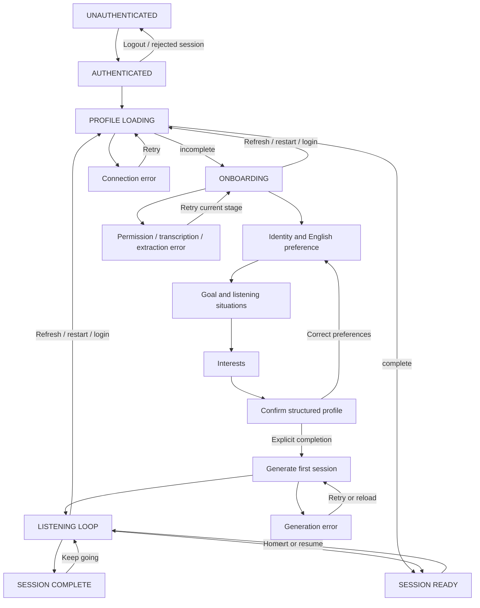

# Authenticated lifecycle and spoken onboarding (AUD-15)

Implementation is local and awaits security/architecture review. AUD-14 production acceptance passed on 2026-10-07; its final Linear comment is authoritative over older pending-verification notes. AUD-15 remains In Progress. No daily lockout (AUD-16), production changes, commits or deployments.

## Before this change

AuthGate restored confirmed Supabase sessions and mounted a private lesson keyed to account/session generation. FastAPI verified every bearer token and initialized an account-scoped default profile. A new learner with no exercise saw a typed name/goal form. PUT /profile saved `profile_saved`; generation created a session/exercise and the introduction opened. Home restored the latest exercise and conversation for returning learners. Setup visibility depended on exercise existence, not onboarding completion. Onboarding had neither spoken stages nor explicit completion; existing lesson checkpoints were already durable.

## Authoritative navigation contract

`app.onboarding.application_destination(profile)` makes the routing decision. GET /profile and GET /onboarding return its `destination`. ApplicationFlow validates it and mounts either SpokenOnboarding or the existing Audli lesson. It never infers completion from a name, attempt count, local storage, exercise existence or token refresh.

Onboarding statuses use the existing allowed values:

| Status | Checkpoint | Primary action |
| --- | --- | --- |
| not_started | identity, revision 0 | Let's talk |
| in_progress | identity, needs or interests | Record answer; finish; confirm recognition |
| profile_saved | review | That's right. Let's train your ears. |
| complete | review | Session ready / start training |

Every stage can hold one pending recognition (text, uncertainty, confidence/source), allowing recognition review after refresh/restart. Processing failures retain the current stage. A recorded browser blob survives a failed upload for retry during that page lifetime; an unuploaded recording cannot survive refresh and must be recorded again. Successfully confirmed answers discard the pending recognition and retain only extracted preferences. Audio generation errors expose prompt text, replay retry and the current primary action. Permission failures offer retry and spoken-file upload. Initial loading errors offer Retry connection. Revision conflicts offer Reload saved progress; completed stages are not replayed automatically.

Existing AUD-14 typed `profile_saved` learners have no spoken checkpoint: they explicitly start the identity stage, then capture the remaining preferences. Existing learning evidence/difficulty/history and the legacy account remain intact. Already `complete` learners never see onboarding. A learner can explicitly reopen the three preference stages before completion using Correct my preferences; this does not reset learning state. No completed-onboarding reset is offered.

## Short voice conversation

Three grouped turns target roughly 3–5 minutes including recognition checks, with no timed requirement:

1. What should I call you, and what language do you want to train? Audli currently trains English listening.
2. Why are you learning English, and what do you most want to understand better? Describe situations where listening is hardest or most important.
3. What topics do you enjoy? A few interests, or no preference, are enough.

Audli speaks using the existing provider `speak`; the learner records using existing capture/upload helpers; the API validates/deletes audio and transcribes using the existing provider. The learner confirms/corrects recognition before structured extraction. OpenAI returns a strict ProfileExtraction: nullable bounded name/language/goal and bounded lists of freely named situations/interests. Application code validates required fields for that stage, rejects unsupported languages and chooses progression. No preference becomes general topics. Missing/malformed extraction cannot advance the checkpoint; the learner can correct recognition or record again. Profile review shows what was extracted and offers explicit correction before completion.

English is the only supported target, consistent with AGENTS.md and the existing `Literal['en']`. Unsupported languages return a recoverable 422 instead of pretending to offer another language. Demo extraction/transcription is explicitly synthetic/manual; it does not establish real extraction quality.

## Persisted data and provisional listening state

Existing relational name, target_language, goal, interests, target_situations and onboarding_status are reused. The existing profile `data` JSON/JSONB snapshot gains a version-1 typed `onboarding` object with stage, monotonically increasing revision and one nullable pending Transcription. Historical snapshots lacking the object default to identity/revision 0. No raw microphone bytes or full onboarding conversation history are retained. Pending recognized speech is sensitive data retained only until successful confirmation; a failed/interrupted stage retains that one checkpoint to support resume.

The existing .7 listening values are algorithmic starting priors, not onboarding-derived scores. Existing slower B1 difficulty remains unchanged. `initial_listening_profile` stays null for a new learner until the existing fully evidenced final exercise assessment establishes it. Onboarding never calls evaluation/adaptation, changes attempt counts or fabricates a score. Existing learners retain their actual learning state.

**No Migration 002 is required.** The checkpoint fits the existing versioned JSONB domain snapshot; all queryable fields/status values already exist. save_onboarding reads the current account row with a database lock, compares revisions and writes preferences/checkpoint plus projections in one transaction while preserving current learning fields. SQLite uses BEGIN IMMEDIATE. A stale tab/request cannot overwrite a newer onboarding revision. Migration 001 and relational schema are unchanged (SHA-256 f6e51fc8983b97d32f775142b0a996c7ca8a68ca9be9ba81c0df8e544143b1cf). Startup schema validation still requires version 1; no production SQL is needed. Changes follow the existing single-worker provider checkpoint contract.

## API contract

All routes below require the same verified identity as existing private routes; none accepts learner identity.

| Method/path | Input | Behavior |
| --- | --- | --- |
| GET /api/profile | none | Existing profile/provider plus authoritative destination |
| PUT /api/profile | existing name/goal | Retained compatibility endpoint; refuses any started spoken checkpoint, in_progress/complete or existing exercise; cannot complete spoken onboarding |
| GET /api/onboarding | none | Profile, stage, revision, prompt, pending recognition, destination |
| POST /api/onboarding/start | revision | Initializes not_started or legacy profile_saved without spoken progress; resumed/completed states return unchanged |
| POST /api/onboarding/attempts | multipart audio + revision | Existing audio validation/transcription; saves one pending recognition without advancing stage |
| POST /api/onboarding/answer | revision, text, confirmed=true | Requires a pending recorded answer; extracts/validates stage preferences; clears recognition and advances atomically |
| POST /api/onboarding/revise | revision | Review only; explicitly reopens identity, retaining preferences/learning state |
| POST /api/onboarding/complete | revision | Requires profile_saved/review; atomically sets complete; repeated completion returns current state without another mutation |
| POST /api/onboarding/audio | revision | Current prompt through existing TTS/sanitization; returns private no-store audio bytes, with no durable cache or audio URL |

Bad input/extraction is 422; changed or invalid stages are 409; provider/backend failures use existing credential-free 503 handling; missing/invalid auth is 401. Origin and upload/JSON body guards remain in force. Lesson generation/evaluation/conversation/transcript/audio endpoints keep their established behavior. Direct legacy API exercise generation is retained for compatibility; application navigation requires completed onboarding and only the dedicated completion route can set that status.

## Frontend and first-session behavior

ApplicationFlow inside AuthGate owns profile loading/retry and chooses one private screen. SpokenOnboarding uses the existing branding, mascot, card/buttons, accessible prompt text, private prompt audio, microphone capture and spoken-file fallback. Every asynchronous continuation uses LessonLifetime/LessonOperation. Prompt playback tries automatically and offers replay if autoplay is blocked. Its stable audio ref pauses only on replacement/unmount or intentional recording/cancellation, not ordinary rerenders. A stale prompt-audio revision triggers one authenticated checkpoint reload and one retry for the same stage; changed stages use the saved checkpoint. Successful same-stage audio is retained across recognition revisions rather than regenerated. All recovery remains inside the original account/session operation lifetime. Recording begins on the primary button and is bounded by the existing 119-second recorder limit. After transcription, raw browser blobs are released; failed upload blobs remain available for retry. All microphone tracks and playback stop on unmount/logout; prompt blob URLs are revoked on replacement/unmount. Late media acquisition releases tracks and cannot resume under a later account.

After completion, generation runs immediately and opens the existing lesson introduction. If generation fails, retry invokes idempotent completion/generation; refresh reaches session-ready Home with Start training. Generation passes the whole newly persisted LearnerProfile to the existing provider. The OpenAI prompt now explicitly selects a scenario from goal/interests/target situations, while keeping exact difficulty and existing repair bounds. Demo material remains fixed. No new provider or voice infrastructure is introduced.

Returning users load the same authenticated profile and bypass onboarding entirely. Home starts a new clip when the latest exercise is complete or absent, or resumes an unfinished clip/conversation. Existing V0.2.1 assessment checkpoints, uncertain recognition handling, unknown evidence, bounded 0–2 follow-ups, terminal feedback composer, adaptation, transcript gates and secondary metrics are untouched.

## Security and deployment configuration

AUD-14 server verification, request-scoped account repository, ownership/404 behavior, unauthenticated 401, exact origins/body limits, auth/session generations, private bearer audio fetching, blob cleanup and Postgres durability remain the boundaries. Supabase session behavior is unchanged; ordinary SDK token refresh preserves the account/session generation ([Supabase sessions](https://supabase.com/docs/guides/auth/sessions)). No secrets, browser UUID authorization, client database access, service-role credentials, RLS policies or grants are added. Requests already accepted by FastAPI may finish for their original account after browser cancellation; they cannot use a later account's credentials.

Local: no new environment values/dependencies. Reuse development SQLite/local Auth or documented Supabase development Auth with a disposable database. OpenAI mode is required for actual speech recognition/extraction; Demo mode is manual/synthetic. Keep HTTPS/localhost for microphone access.

Supabase: no changes. Keep confirmed email/password Auth, anonymous sign-ins disabled, exact redirects, existing publishable key and denied browser table access.

Render: no changes. Keep existing production Postgres/Auth/OpenAI settings and one API worker. No migration, infrastructure modification or new service is required.

Vercel: no changes. Keep same-origin rewrite, public Supabase URL/publishable key and existing BACKEND_URL. Reviewed code releases would require ordinary backend/frontend deployment later; this implementation performs none.

## Exact owner production acceptance procedure after review/approved release

1. Do not apply database SQL. Confirm schema_migrations still contains version 1 and baseline hash is unchanged. Preserve existing/legacy learner rows. Retain AUD-14 Auth/RLS/origin/settings and secrets.
2. Release the reviewed backend/frontend code only after separate owner approval. Use a fresh confirmed test account A and separate confirmed account B in two browser profiles. Do not edit their database profiles to make onboarding work.
3. Before sign-in, request GET /api/onboarding and POST /api/onboarding/start without bearer credentials: expect 401. Confirm public health/auth-config still work. Sign in as A; GET /profile must report onboarding and not_started; no lesson content/transcript should appear.
4. Click Let's talk. Hear/replay the first prompt; record a name and English preference. Check recognized text, correct recognition if necessary, confirm. Verify stage needs, name/language saved, difficulty unchanged, completed_attempts unchanged and initial_listening_profile null.
5. Record goal/listening situations naturally (use an uncategorized example such as incident handover discussions). Refresh before confirming recognition; verify the pending answer is restored. Confirm it; refresh again; verify interests is next and identity/needs are not repeated.
6. Sign out during onboarding. Sign into B; it must have independent default onboarding. Sign back into A; verify the exact saved stage/preferences. Restart Render, then reload A; verify the same checkpoint with no manual database update.
7. Finish interests and inspect profile review. Confirm goal, freely named situations and interests. Test Correct my preferences before completion if needed; it explicitly reopens preferences and leaves difficulty/history unchanged.
8. Confirm That's right. Let's train your ears. Verify complete persisted and first exercise generated directly into introduction. If generation fails, retry; if the completion response is lost, reload saved progress. No duplicate completion or extra active exercise should occur. Inspect the backend-generated exercise privately after assessment to verify relevance to goal/interests/situations; never expose its script before assessment. Verify no fabricated onboarding score.
9. Finish listening -> spoken summary -> recognition -> assessment -> meaningful insufficient-evidence follow-up(s), at most two -> final coaching -> adaptation -> session completion. Before final assessment transcript is 403; afterwards it is available. Unknown evidence is not a zero/correction; incomplete evidence keeps difficulty stable; one primary difficulty variable changes at most. Feedback has no questions/metrics, at most three sentences and the configured <=50-word cap. Failed coach TTS must preserve assessment.
10. Reload, sign out/in, then use another device/browser profile for A. Verify onboarding is skipped and Home restored. Restart Render again; profile/history/difficulty/audio remain durable. Start training resumes an unfinished exercise or generates from current persisted difficulty. Keep going remains available; AUD-16 lockout is absent.
11. With B's own token, request A's exercise audio, coaching audio, transcript, conversation and attempts: expect 404. Onboarding routes only operate on B regardless of supplied query/header UUID; extra learner_id in JSON must be 422. Verify A's preferences/stage unchanged.
12. Use browser request throttling/blocking to delay A's microphone, onboarding upload and answer response separately; sign A out, sign B in, then release each. B must show only its own profile; no A continuation may write/generate under B's token; late streams stop and blobs are released. Sign out during active recording/playback; both must stop immediately.
13. Deny microphone access; allow/retry or upload a valid spoken file. Simulate transcription/extraction/API/TTS failure through browser request blocking, without changing production configuration. Verify actionable recovery, saved stages unchanged, uncertain recognition review, and failed upload retry. Check malformed/unsupported-language answers do not advance. Check invalid audio 422, oversized upload/JSON 413 and unapproved Origin 403.
14. Repeat POST /onboarding/complete after successful completion: unchanged complete state. Check A/B/legacy state after restart. Record the exact outcomes, real extraction/TTS quality and onboarding duration in AUD-15; leave it In Progress until separately approved and fully accepted.

## Verification and limitations

Automated tests mock Auth and AI; they establish state/security/storage plumbing, not actual natural-language extraction, comprehension evaluation or hosted deployment quality. Real OpenAI spoken extraction and 3–5 minute pacing require the owner acceptance above. No production calls were made. Browser coverage is Chromium; microphone/codec/autoplay behavior on other browsers remains manual. Preferences correction before completion reopens all three short stages intentionally. Unuploaded microphone blobs cannot survive refresh. No daily budget, account recovery UI, retention/export/deletion policy or wider public-alpha hardening is introduced.

Final verification results are recorded below after the complete checks finish.

### Final local verification, 2026-10-07

| Check | Result |
| --- | --- |
| Complete backend suite, including real SDK/mock-HTTP extraction | 284 passed |
| SQLite + PostgreSQL persistence/auth/onboarding suites | 125 passed on disposable PostgreSQL 18.6 |
| Final onboarding suite after stale typed-setup guard | 30 passed across SQLite/PostgreSQL |
| Existing frontend helper suites | 38 passed |
| Complete Chromium browser suite | 27 passed |
| Frontend lint, standalone typecheck and production build | Passed |
| Python compilation (app/tests/scripts), git diff --check | Passed |
| Migration 001 hash | Unchanged |
| Hosted/real OpenAI onboarding acceptance | Pending owner acceptance after review |

Initial sandboxed runs encountered an audio subprocess stall; complete unsandboxed runs passed. The first browser attempt overlapped the browser download; subsequent complete runs passed after installation. A Next.js startup timeout on the mounted drive was resolved on the diagnostic rerun. Generated Next route references were restored. The disposable Postgres cluster was stopped after verification; no production database/service was accessed.

Files changed: app/main.py, app/models.py, app/onboarding.py, app/onboarding_api.py, app/services/provider.py, app/services/demo.py, app/services/openai_provider.py, app/storage/repository.py; web/app/page.tsx, web/components/onboarding.tsx, web/tests/auth.spec.ts, web/tests/lesson.spec.ts; tests/test_onboarding.py, tests/test_openai_provider.py; docs/APPLICATION_FLOW.md, docs/AUTHENTICATION.md, docs/PERSISTENCE.md.

### Security-review small-fix verification

This pass fixes only the unstable audio callback ref and the start/initial-TTS revision race. Server revision checks, authentication, repository/schema and configuration are unchanged. No optional generation-context change was made. Existing TTS-failure browser coverage remains; successful cases use valid PCM and instrument Chromium's native playback. The four required regression areas have five cases, with completion and first-generation cancellation tested separately.

Final checks: complete backend **284 passed**; SQLite persistence/auth/onboarding **73 passed**; persistence/auth/onboarding with disposable PostgreSQL **125 passed** (combined SQLite/PostgreSQL parametrizations); onboarding-specific SQLite/PostgreSQL **30 passed**; frontend helpers **38 passed**; final complete Chromium suite **32 passed**, including all five new regression cases. Production build and its TypeScript check passed; standalone typecheck, lint, Python compilation and diff checks passed. Production dependency audit: **0 vulnerabilities**. Migration 001 SHA-256 remains `f6e51fc8983b97d32f775142b0a996c7ca8a68ca9be9ba81c0df8e544143b1cf`; no Migration 002. Disposable PostgreSQL stopped; generated Next route references restored.

The first new-test run exposed a delayed-body fixture issue: reading a network body only after logout exercised fetch abortion rather than a successful late body. The final fixture buffers a valid response before delaying its delivery, and both final complete Chromium runs passed. An initial sandboxed browser-server launch failed; approved external runs passed. Hosted/real OpenAI acceptance and previously deferred public-alpha hardening remain pending; no production actions or AUD-16 work were performed.
