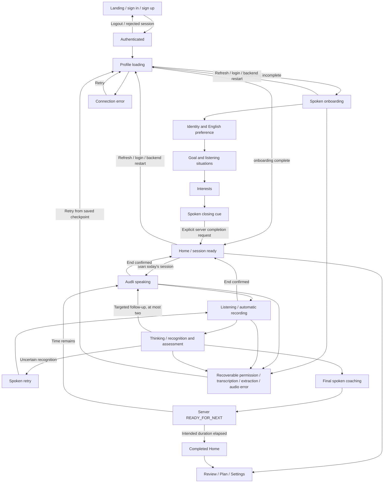

# Authenticated application flow and hands-free coaching (AUD-15 / AUD-17)

AUD-17 implements the owner-approved written product-shell/session specification and the persisted Figma Mascot System (`TOyKOA5mrWAWI8WvvS7lvy`, nodes `7:23`–`7:80`). The other two Figma pages were lost by the connector; their absence is not a design brief. This implementation is local, uncommitted and awaits review. No hosted acceptance is claimed here. AUD-17 remains In Progress.

## Authoritative navigation

`app.onboarding.application_destination(profile)` remains the sole onboarding routing decision. ApplicationFlow loads GET /profile inside AuthGate and selects onboarding or the authenticated product shell. Names, exercise existence, browser timing and token refresh do not decide onboarding completion.

The landing and auth screens contain no learner data. Sign-up preserves confirmed-email behavior. The account/session-keyed private component and token provider are unchanged in responsibility. Settings exposes the existing local sign-out operation; logout immediately invalidates operations and unmounts private content before remote sign-out completes. Cross-tab sign-out/account change also cancels old work. Ordinary token refresh preserves the operation generation.

## Spoken onboarding

The existing persisted state machine is unchanged: `not_started` → `in_progress` (identity, needs, interests) → `profile_saved` (review) → `complete`. Three grouped spoken turns capture preferred name/English, reason/listening situations and interests. Application code still validates structured extraction and chooses stages. English is the only supported language. Speaking fluency never supplies listening evidence.

After Let's talk, `/onboarding/start` resolves before prompt audio is requested. This removes the old revision-0/start race. Every prompt audio request still includes its checkpoint revision. A 409 reloads the authoritative checkpoint using the **same LessonOperation**, then retries audio at most once if the stage is still appropriate. A changed stage, pending answer or completed profile takes its saved path instead. No optimistic concurrency protection is relaxed.

Successful recognition is not shown in a form. The client submits its unedited text with `confirmed: true, hands_free: true`; the server checks the saved recognition, confidence and uncertainty before extraction. Recognition with uncertainty, null/low confidence or blank text receives a spoken retry and automatic listening. After two consecutive automatic recognition retries, recovery pauses with an actionable microphone/retry message. Failed extraction preserves pending recognition; retry/refresh restores that checkpoint without repeating completed stages. Malformed extraction and unsupported language remain recoverable 422 responses.

The review stage now speaks a short closing statement, then makes the explicit, idempotent `/onboarding/complete` request. Completion returns to Home; the first listening session starts with Home's primary action. There is no routine recognition or profile-confirmation form. The existing review-only `/onboarding/revise` endpoint remains compatible, but a completed-profile editing feature is not invented. Legacy `profile_saved` learners without spoken progress still explicitly begin identity. No completed onboarding reset is offered.

## Hands-free session lifecycle

`useVoiceLifecycle` owns the presentation/audio state; the server conversation owns learning progression. Its account-bound LessonOperation spans the continuation through audio, recording, upload, assessment, follow-up and coaching. Pure visual components receive state and never choose evidence, follow-ups, scores or adaptation.

1. Start requests microphone permission, then loads/resumes the current authenticated exercise and conversation.
2. LISTENING plays the private exercise automatically. Only its ended event requests `/conversation/listened`.
3. AWAITING_SUMMARY/AWAITING_FOLLOWUP plays the issued coaching cue, then records automatically.
4. The original MediaRecorder helper collects the final chunk before upload. Web Audio measures microphone RMS locally: at least 300ms of voice, at least two seconds of recording and an 1.8-second silence gap end a normal turn. No speech ends after 15 seconds; continuous sound remains capped at 119 seconds. This is turn detection, not a new ASR/evaluation provider. Tracks, analyser/source, timer and AudioContext are cleaned on completion/cancellation.
5. The original recording Blob is retained only during a failed transcription request. Successful transcription releases it; server pending recognition supports reload/restart. No transcript textarea or routine confirmation appears.
6. Reliable unedited recognition automatically requests assessment. Server ASR guards run before evaluator/checkpoint mutation; evaluator transcription concern still rejects without adaptation. The pending recognized answer remains available for retry. Previously learner-confirmed corrections are restored verbatim through the compatible manual API path. If a transcription response is lost after the server saved it, that pending checkpoint supersedes the retained upload Blob; a follow-up always records fresh audio.
7. The server's follow-up or GIVING_FEEDBACK response determines the next spoken cue. Follow-ups automatically return to listening. Final coaching completes before `/conversation/ready`.
8. At READY_FOR_NEXT, the client either generates another exercise using the authenticated persisted profile or returns to completed Home when the intended duration has elapsed. Adaptation still happens only in the existing final assessment transaction.

The intended duration is ten minutes (`SESSION_DURATION_MS`). The countdown uses actual elapsed wall-clock time and whole minutes. At expiry it says “Finishing this conversation”, never zero, while the current finite server conversation finishes. It cannot interrupt an assessment or claim completion early. Account/session-scoped sessionStorage stores only start time and active/paused/complete presentation status. Refresh restores timing when available and **always** reloads server conversation state. Clearing storage, switching devices or logging out does not lose learning checkpoints; a new Start resumes the server exercise with a new local timing window. This is pacing, not a new server session/eligibility model. AUD-16 daily enforcement is absent; completed Home retains an optional Start another session action.

Replay rewinds only currently playing audio. It does not create another request, restart recording or repeat a domain transition. End opens an accessible confirmation; confirming stops playback/recording, aborts operations, discards unuploaded audio and returns Home. Saved server progress remains. Late microphone acquisition stops its tracks; late successful audio bodies cannot create blob URLs after cancellation. Object URLs are revoked in playback cleanup. Stable object refs mean ordinary rerenders never pause or regenerate speech.

TTS/autoplay/network/microphone failures pause in a recoverable state with Retry conversation and accessible cue text. Retry reloads the server checkpoint, preserving final assessments and pending recognition. Native speech/codec/autoplay restrictions can require a user gesture on this exceptional path. Automatic turn detection requires a browser with MediaRecorder and Web Audio; unsupported browsers receive an actionable error rather than a misleading recording state. No realtime/WebRTC, custom ASR/TTS or new providers are introduced.

## Product shell and mascot

Home has one dominant Start today's session action, the living mascot and a concise listening description. Completed Home uses restrained success motion and Review today. Review shows recent persisted coaching observations and eligible transcripts; it does not show internal scores. Transcript requests remain server-gated. A collapsed secondary transcript appears in the active session only after a server final result; Review accesses completed history. Plan explains saved goals and the application's automatic learning approach without adaptation controls. Settings contains account, voice/playback, accessibility, privacy and help explanations. Floating Home / Review / Plan / Settings navigation is absent in focused sessions.

The mascot uses inline vector geometry from the approved Figma export: teal bridge, white opening, blue and coral ear pads; no eyes/mouth. Listening marks, thought dots, waves, restrained success marks and retry cue follow the supplied storyboard. CSS provides 3.5s breathing at 1–1.025 scale, attentive 2.5° listening, 3px thinking drift/dot rhythm, playback-driven speaking movement, a single 160ms success lift/squash and 3° retry pose. Listening marks react to detected microphone activity. Speaking motion follows actual successful playback lifetime; it does not analyse TTS amplitude. No GIF/video, spinner, confetti or gamification is used.

System prefers-reduced-motion always disables animation; Settings can additionally reduce motion. Static poses, state text, focus rings, keyboard-operable navigation, cue text and a focus-contained/Escape-dismissable exit confirmation preserve comprehension without motion.

## Minimal API additions

All routes retain existing server-verified Supabase identity, request-scoped ownership, origin/body limits and no-store private responses. No endpoint accepts learner identity.

- GET /api/profile additionally returns `recognition_min_confidence`, the existing configured threshold.
- POST /api/onboarding/answer and POST /api/attempts/{id}/assess additionally accept optional `hands_free` (default false for compatible manual clients). Automatic text must match saved recognition and pass the confidence/uncertainty gate. Manual confirmation behavior remains compatible. Automatic assessment rejection uses existing 422/uncertain semantics; no evaluator is called and no learner state is changed.
- POST /api/recognition/retry-audio speaks one fixed recovery phrase through the existing provider/sanitization boundary. It is authenticated, contains no learner content, retains no audio and cannot advance any checkpoint. Client automatic retries are bounded; public provider budgets remain deferred hardening.
- Onboarding's closing prompt copy changes; completion, revision locks, persistence formats and all other contracts remain unchanged.

## Persistence, security and configuration

AUD-15's version-1 onboarding object remains in the existing profile JSON/JSONB snapshot. Atomic account-scoped revision comparisons/projections, SQLite BEGIN IMMEDIATE, PostgreSQL transactions, historical defaults and legacy learner compatibility are unchanged. No Migration 002 or production SQL is needed. Migration 001 SHA-256 remains `f6e51fc8983b97d32f775142b0a996c7ca8a68ca9be9ba81c0df8e544143b1cf`.

The existing **single API worker** requirement remains. No changes to Supabase, Render, Vercel, .env, dependencies, schema, provider configuration or auth/persistence architecture are required. Browser session timing is never authorization. Requests already accepted by FastAPI may finish for their original account after cancellation; they cannot adopt another account's token. Audio remains private bearer-fetch content. PostgreSQL learner isolation/durability, transcript gates, demonstrated/misunderstood/insufficient-evidence semantics, zero-to-two follow-ups, final-feedback limits and deterministic one-variable adaptation are preserved.

## Controlled acceptance after approved release

1. Use separately confirmed test accounts A/B. Verify Landing sends no learner requests and unauthenticated retry/onboarding routes return 401. Confirm sign-in/signup/logout and token refresh still work; no infrastructure changes or SQL are needed.
2. On A, start onboarding and speak the three grouped answers. After the initial gesture and browser microphone permission, finish without tapping. Verify preferred name, English, goal, free-form situations and interests in the authenticated profile; listening priors/counts must not change. Completion must enter Home.
3. Refresh/logout/login after each stage and while a recognized answer is pending. Restart the backend and repeat. Completed stages must not repeat; completed learners skip onboarding. B must retain an independent profile/checkpoint.
4. Start a real ten-minute session. Verify exercise → spoken cue → listening → processing → follow-up(s), if warranted → final coaching happens without clicks. Check silence turn ending in a quiet room and realistic pauses/background noise. Confirm the 119-second limit, whole-minute countdown and completion only after server coaching/READY_FOR_NEXT. Time can overrun while the final exercise completes.
5. Check replay during speech, End/Stay with mouse and keyboard, focus containment and Escape. End during speech/recording/provider work must stop resources and discard browser continuations while preserving server progress.
6. Verify uncertainty/no speech conversationally retries without an ASR form or learning-state change. Deny permission, block transcription/extraction/TTS requests and retry; saved recognition/assessment must remain. Repeated uncertainty must pause rather than loop indefinitely.
7. Delay A's permission, audio body, checkpoint reload, extraction, completion and exercise generation; switch to B, then release. No A UI/audio/result may appear under B, no A continuation may use B's bearer token, and late media/URLs must be cleaned.
8. Before final assessment, transcript requests remain 403. After completion, Review may load the eligible transcript; B's requests for A's exercise/audio/attempt remain 404. Verify at most two insufficient-evidence follow-ups, unknown remains unknown, misunderstood evidence receives correction, final coaching has no questions/metrics and deterministic adaptation changes at most one variable.
9. Inspect mobile/desktop layouts and all six mascot states. Test OS reduced motion and Settings reduction. Verify Home/Review/Plan/Settings navigation and restored authenticated content after refresh.
10. Repeat on real supported Chrome/Safari/mobile devices: browser speech playback, microphone codecs, Web Audio resumption and silence thresholds require actual acceptance. Record hosted outcomes in AUD-17; do not mark it Done from local mock tests alone.

## Verification and deferred work

Automated Auth/AI/media fixtures establish plumbing, isolation and state transitions, not real evaluator accuracy or natural spoken performance. AUD-15's prior verified baseline was backend 284, combined SQLite/PostgreSQL 125, onboarding 30, frontend helpers 38 and Chromium 32. AUD-17 results will be recorded after final checks.

Deferred: public provider budgets/rate limits, TTS coalescing, broader browser/device acceptance, privacy retention/export/deletion, profile-editing product flow, multi-worker redesign and AUD-16 daily eligibility. No placeholder settings, new goals API, dashboard or adaptation algorithm is invented. Figma's missing shell pages are represented by the owner's explicit replacement specification, not an inferred redesign.

### Final local verification — 2026-10-07

| Check | Result |
| --- | --- |
| Complete backend suite | 294 passed |
| SQLite persistence/auth/onboarding/automatic-recognition cases | 83 passed |
| Combined SQLite/PostgreSQL persistence/auth/onboarding/recognition | 137 passed |
| Onboarding/recognition-specific SQLite/PostgreSQL | 42 passed |
| Frontend helper suites | 42 passed |
| Full Chromium suite | 45 passed |
| Lint / standalone typecheck / production build | Passed |
| Python compilation / git diff check | Passed |
| Production dependency audit | 0 vulnerabilities |
| Migration 001 | Byte-identical; no Migration 002 |
| Hosted speech/device/production acceptance | Pending owner review and approved release |

The Chromium suite includes click-free completion, automatic follow-up/retry, real PCM playback across ordinary rerenders, private delayed audio-body cancellation, stale-checkpoint recovery under the original operation, pending-answer resume, preserved prior learner corrections, lost transcription response followed by fresh follow-up capture, End cancellation during capture/assessment, transcript gating, reduced motion, elapsed timing, keyboard exit controls, token refresh and account-switch races through completion/generation. Synthetic provider/media tests do not establish real learner speech quality.

Initial browser assertions needed adjustment for Next.js's separate alert element, Landing after logout and nonserializable function-valued race probes. An initial stale-bundle countdown check and restricted local PostgreSQL/socket runs failed; final complete browser and externally approved local PostgreSQL runs passed. No production system was accessed. The disposable PostgreSQL instance was stopped, generated Next references were restored, and generated/browser artifacts are excluded from the diff. No commit, push or deployment was performed.

### AUD-17 acceptance and AUD-18 visual polish — 2026-10-07

The owner completed local manual end-to-end hands-free onboarding/session acceptance with a real microphone. AUD-17 was accepted, committed and pushed as `66acbf1f48338293d90f3fe02e4101b0515d83c3`, and marked Done. This records local acceptance, not a hosted production acceptance run or manual deployment.

AUD-18 retains the accepted lifecycle and approved Figma Mascot System geometry. Presentation changes only: responsive mascot sizing (up to 420px in desktop sessions and 300px on Home), quieter shared typography/header/control treatments, spacing and compact floating navigation, smooth pose/cue transitions, and a distinct teal Listening label. Idle breathing remains 3.5 seconds/2.5%; Speaking breathing is 2 seconds with restrained playback-state waves; Thinking uses slow drift/dots; Retry tilts 3 degrees; Success has one 160ms lift. Persistent SVG cues fade independently of their motion. System or Settings reduced motion disables motion/transitions while preserving static poses, cues and accessible state text.

The initial visual-polish pass introduced no new controls, domain decisions, API changes, authentication/persistence changes, migration, configuration, or daily eligibility. Its manual acceptance identified the three follow-up fixes below; visual retesting remains pending. Browser screenshots are temporary local inspection artifacts, not committed assets.

AUD-18 final verification: complete backend 294 passed; combined SQLite/PostgreSQL persistence/auth/onboarding/recognition 137 passed; frontend helpers 42 passed; full Chromium 50 passed (including five added visual/accessibility regressions); lint, standalone typecheck, production build, Python compilation and diff checks passed; production dependency audit 0 vulnerabilities. Inspected 320px mobile and 1440px desktop captures for Home, Listening, Landing and Auth; all four shell destinations have overflow/navigation checks. Checked primary, secondary, active-navigation and Listening text contrast (minimum 4.62:1).

An initial overlapping build/browser type-generation run left malformed ignored Next.js test types. Those generated artifacts were removed; the sequential production build and standalone typecheck passed. Generated Next references were restored and the disposable PostgreSQL instance stopped. AUD-18 remains uncommitted/In Progress pending visual acceptance; no manual deployment or production changes were made.

### AUD-18 manual-acceptance fixes — 2026-10-07

**Measured latency before changing behavior.** A bounded local FastAPI/SQLite diagnostic used synthetic speech and the configured development OpenAI provider, without production dependencies or learner content. Stage times are inclusive endpoint measurements; provider-only times were also measured. These are individual samples, not a controlled performance benchmark or a physical-microphone result.

| Stage | Before | After |
| --- | --- | --- |
| Silence detection | Existing 1.8s threshold | Unchanged |
| Recording finalization | Browser instrumentation added; not physically measured | Unchanged lifecycle |
| Upload/validation/transcription/persistence | 1.369s (STT 1.117s) | 2.267s (STT 1.994s) |
| Assessment/decision/persistence | 9.527s (provider 9.492s) | 4.901s (provider 4.872s) |
| TTS/sanitization/persistence/body readiness | 4.096s (provider 3.742s) | 2.321s (provider 1.976s) |
| Separate authenticated audio GET/body | 0.038s locally | Eliminated |
| Recording-ready to audio body | 15.030s | 9.489s |
| Browser playback start | Instrumented separately; not physically measured | Same protected playback lifecycle |

The apparent improvement between samples is predominantly provider variability, not an optimization guarantee. Assessment depends on recognized evidence; speech depends on the authoritative follow-up/final coaching decision. Those calls remain sequential. The safe optimization is one fewer authenticated HTTP round trip: POST `/api/exercises/{id}/coach-audio` with `Accept: audio/*` returns the same owned, gated, sanitized, persisted audio directly. Default JSON and existing private GET clients remain compatible. No speculative response, model/prompt change, evaluator change or altered silence threshold was introduced. Genuine Thinking includes recording finalization and provider work. A consistent 2–5-second turn is not established by these measurements.

Development-only browser timings report silence detection, finalization, upload/transcription, assessment or onboarding extraction, TTS readiness, playback start and total turn-to-playback. API development logs measure lock wait, audio validation, transcription, assessment/extraction and TTS provider/sanitization boundaries. Only fixed stage names and elapsed milliseconds are logged; no audio, transcript, profile content, token or secret is included. Production timing output is disabled.

**Explicit End versus interruption.** Confirmed End stops the account-bound voice lifetime and discards unuploaded capture. A minimal browser-local, account-specific Boolean presentation marker persists across refresh/logout/login, separately for onboarding and lessons. It is never authorization or server progress. Returning after End is silent until an explicit Start/Resume gesture. An unfinished lesson restarts its original clip from the beginning before continuing the saved authoritative checkpoint; a completed exercise is preserved and the next Start generates a new exercise. Onboarding retains its captured stages/recognition and waits for Resume. Accidental refresh without End continues the existing resume behavior. Saved recognition, history, evidence and adaptation are not deleted or reset.

This presentation intent is scoped to the same browser and does not synchronize across devices. Blocked browser storage conservatively requires a gesture. A request already accepted by the backend may finish for its original account after End; browser continuations are canceled and cannot use a later account's credentials. No server termination contract, persistence schema, authentication architecture or daily eligibility was added.

**Mirrored mascot cues.** Speaking and Listening use one SVG path definition for the corrected right cue and an exact reflected `<use>` for the left, about the approved body bounds' center. Both sides share size, 1.8-unit round stroke, spacing and motion. Browser geometry checks include maximum 1.025 horizontal scale plus stroke padding inside the viewBox. Approved body geometry and reduced-motion behavior remain intact.

Final acceptance-fix verification: complete backend **298 passed**; combined SQLite/PostgreSQL persistence/auth/onboarding/hands-free **140 passed**; frontend helpers **45 passed**; full Chromium **57 passed**. New regressions cover End/return silence for unfinished and completed lessons, retained onboarding after refresh/relogin, accidental refresh resume, single-request coaching audio, safe development timing fields, delayed successful inline-audio account switching, identical mirrored SVG references and maximum bounds, audio ownership/cache compatibility, TTS failure preserving final evidence and canceled lock wait safety. Lint, standalone typecheck, production build, Python compilation and final diff checks **passed**; production dependency audit reports **0 vulnerabilities**. Generated Next references were restored; browser artifacts and temporary diagnostic scripts remain excluded from the diff. The disposable PostgreSQL instance was stopped. Migration 001 remains byte-identical and no Migration 002 is required.

Manual retest: time real microphone turns using development browser/API stage logs; verify End during speech, capture and processing leaves Home/onboarding silent on return; Start/Resume should reorient without losing evidence or captured profile fields. Separately refresh an active conversation without End and verify automatic resume. Inspect both yellow cues during Speaking and voice-active Listening on mobile and large desktop, including reduced motion. Provider-dependent latency remains the principal limitation. AUD-18 stays In Progress and uncommitted; no production deployment/configuration/migration was performed.

### AUD-18 final local acceptance — 2026-10-08

The owner confirmed local visual and functional acceptance of the approved fixes. The full pending diff was reviewed: development latency instrumentation and inline coaching audio, explicit End versus accidental-refresh resume semantics, mirrored Speaking/Listening cues, and the existing responsive typography, controls and motion polish are included; no unrelated changes were found.

Closing verification completed successfully: backend **298 passed**; combined SQLite/PostgreSQL persistence/auth/onboarding/hands-free **140 passed**; frontend helpers **45 passed**; Chromium **57 passed**; ESLint, standalone TypeScript typecheck, Next.js production build, Python compilation and diff checks **passed**; production dependency audit **0 vulnerabilities**. Missing Playwright Chromium was installed with the project's existing CLI. Chromium launch and local database tests required execution outside the restricted sandbox. No application workaround or additional browser OS packages were needed. A tool-server restart interrupted intermediate runs; the affected suites were rerun to successful completion. The disposable PostgreSQL 18 instance was stopped and generated Next references restored.

Acceptance is local; synthetic tests do not establish evaluator accuracy or a guaranteed 2–5-second response. Provider variability and same-browser presentation intent remain the documented limitations. No production deployment, configuration or migration was performed; AUD-21 was not started.
### AUD-22 structured conversational lesson lifecycle

The server owns one persisted lesson checkpoint: Welcome → Welcome acknowledgment → optional previous-lesson Review → Review acknowledgment → Transition → Exercises → Closing → Completed. Welcome asks one short check-in; review asks one interests reflection. Reliable recognition is required to accept either, with bounded microphone retries in the browser. Personal responses never supply comprehension scores or adaptation; review extraction only updates topic interests. First-time learners skip historical review; returning learners receive observations from an actual owned completed lesson or legacy training session, never invented history.

The target is 600 seconds of active lesson time. Welcome targets roughly 30–45 seconds, review 30–60 seconds, and closing reserves 90 seconds. These are pacing targets, not timers that cut off speech. The server refuses a fresh exercise when less than 180 seconds remain (90 seconds for a meaningful clip/response plus the 90-second closing reserve). The boundary is checked before generation and again at transactional persistence after provider work. Once an exercise begins, its existing recording, bounded follow-ups, assessment and spoken coaching finish even beyond ten minutes; only then can the server move to Closing. Actual duration depends on learner speech and provider latency; concise closing can finish before the nominal target rather than padding the lesson with silence.

Explicit End stops local media immediately and pauses the server lesson without deleting pending recognition, completed evidence, history or adaptation. Paused time is excluded; an explicit Start resumes. The account-specific browser End marker also prevents unsolicited replay if the pause response is lost. Accidental refresh resumes the authoritative checkpoint and active time; no browser clock or storage value decides whether another exercise is allowed. An unfinished exercise replays its original clip after explicit End, then continues its saved checkpoint. If assessment already completed at End, the resumed lesson proceeds past that exercise without replaying old feedback. TTS or playback failure leaves the phase recoverable. A successfully completed closing is checkpointed separately from its audio cache.

New API: GET `/api/lessons/current` and `/api/lessons/{id}`; POST `/api/lessons/start`, `/api/lessons/{id}/resume`, `/end`, `/audio`, `/heard`, `/attempts`, `/answer`, `/exercise`, `/advance`. Media and phase actions use server revisions; End invalidates pending phase writes without waiting for the provider lock. `/attempts` accepts validated audio plus revision, and `/answer` consumes server-stored recognition. The public checkpoint allowlists prompt, phase, timing, current public exercise and completion observations; it never exposes an unfinished script or rubric. Existing exercise APIs remain available to legacy clients when no lesson is active, but cannot generate around a lesson phase or bypass its active comprehension loop.

The browser uses contextual neutral acknowledgment audio from an owned cached TTS endpoint, without an LLM request. It considers a cue only after reliable recognition, when actual assessment or reflection processing remains pending for 1.2 seconds. Quick work and deterministic welcome responses skip filler. Optional cue readiness races with processing so a slow audio download cannot delay completed work; coaching waits only for a cue already playing. Account/turn keys deduplicate cues across retry and same-browser refresh. Account-bound operations guard body reads, blob creation, playback and subsequent API work. No praise of correctness occurs before assessment.

Exercise coaching is composed from validated evidence and the deterministic event’s focus, with passage-specific supported details where safe and concise; evaluator notes remain unspoken. Closing summarizes actual completed work, a demonstrated strength if available, a useful focus and practical tip. Unknown evidence never becomes a correction or strength. The dedicated completion screen uses the existing restrained Success mascot, “Lesson completed”, personal encouragement, exercise count, focus and supported strength, with Return Home. No scores, progress percentages, daily eligibility or lockout are introduced.

Local verification (2026-10-08): complete backend suite **317 passed**; combined SQLite/PostgreSQL ownership, persistence, onboarding, hands-free and lesson lifecycle suite **170 passed**; frontend helpers **45 passed**; Chromium browser suite **63 passed**. ESLint, TypeScript, production build, Python compilation, migration SQL consistency and diff checks passed; production dependency audit found **0 vulnerabilities**. Chromium required execution outside the restricted sandbox; a temporary Playwright configuration extended server startup time for the slow mounted filesystem without changing application code. PostgreSQL was disposable and stopped after verification. Migration 002 has not been applied to production. Synthetic checks establish orchestration and evidence safeguards, not real-provider evaluator accuracy or exact ten-minute duration. Live conversational and visual acceptance remains for review. AUD-22 remains In Progress; changes are uncommitted, unpushed and undeployed.

### AUD-22 exercise generation recovery

Manual acceptance found a 79-word request returning 50 words, then 44 on its repair attempt. The existing tolerance correctly rejected both: integer limits are 52–110 words. Generation still uses the saved difficulty (`round(duration_seconds × 150 × speech_rate / 60)`), independently of lesson welcome/review text and timing. The configured model remains `gpt-4.1-mini`; no model, difficulty or adaptation change is introduced. The identified prompt weakness was a repair that regenerated from scratch using only the rejected count, without the actual draft. Low-density/simple-language instructions plausibly encouraged concise material; model-internal causes cannot be established from those outputs alone.

The initial prompt now aims within 90%–110% of the target, with natural sentence pacing and explicit script-only counting. It distinguishes accessible language from a shorter passage and keeps assessed detail density stable. One targeted repair receives the rejected structured exercise and the word adjustment toward the target, expands natural context or trims redundancy, and keeps assessed facts and difficulty consistent. The original hard tolerance, schema, difficulty and density validation remain unchanged and run after repair. There are still at most two generation attempts; no automatic additional repair loop or undersized acceptance is added. Existing SDK transport retries remain unchanged. Private drafts are sent only as provider data, never logged.

If preparation fails, the owned lesson endpoint gives a conversational Retry conversation message without server configuration details. Completed progress, revision and exercise membership remain intact. Retry reloads the same checkpoint; an attached exercise is reused, and closing eligibility is rechecked using actual active elapsed time. A failed provider request that crosses the closing boundary also moves safely to Closing, rather than launching another exercise. HTTP conflicts retain their existing cancellation protections.

Recovery verification: focused backend **72 passed**; complete backend **325 passed**; combined SQLite/PostgreSQL **180 passed**; frontend helpers **45 passed**; Chromium **65 passed**. ESLint, standalone TypeScript, production build, Python compilation, migration consistency and diff checks passed; production audit found **0 vulnerabilities**. The initial two new browser tests failed because their alert locator also matched Next.js’s route announcer; the locator was corrected and the full suite then passed. Generated Next references were restored and the disposable database stopped. No live-provider success-rate claim is made; manual acceptance should retest the previously failing lesson. AUD-22 remains In Progress, with all feature and recovery changes uncommitted.

### Conversational naturalness and completion polish

Welcome acknowledgment now uses reliable saved recognition for one brief social reply. It answers reciprocal questions such as “And you?” with Audli’s listening role, acknowledges a positive or difficult check-in, and moves to the existing review/transition. It neither invents personal experiences nor asks another small-talk question. Review acknowledgment references safe extracted interests. No social reply changes comprehension scores or difficulty, and the provider makes one bounded structured request for a meaningful check-in response. It receives the actual recognized utterance, answers reciprocal questions in Audli’s role, and cannot choose lesson phases. The application validates brevity, no questions, and no premature comprehension praise, persists the reply, and appends the listening transition. Provider failure uses a short deterministic fallback. Refresh reuses the saved reply rather than generating another response.

Before each new passage, the server offers a short introduction. Additive optional JSON checkpoint fields `introduced_exercise_id`, `welcome_response` and `review_response`, public `introduction_pending`/`introduction_prompt`, and POST `/lessons/{id}/introduction-audio` plus `/introduction-heard` need no additional SQL migration. Requesting audio does not mark delivery. The protected endpoints check the owned active revision before/after TTS and confirm delivery only after the browser’s audio `ended` event. Refresh/recovery skips confirmed introductions and retries unfinished ones; completed learning progress is retained. A lost confirmation can replay an unconfirmed introduction rather than silently omit it. Active coaching finishes before the next introduction; one account-bound audio queue prevents overlap. The server’s existing generation deadline and active-exercise protection remain authoritative.

Processing cues are “Okay, I heard you.” for assessment, “Okay, I’ve heard that.” for follow-ups, and “Let me keep that in mind.” for reflection. Welcome does not use them. POST `/recognition/acknowledgment-audio` optionally accepts the validated `cue` name; audio caches are owner-scoped and versioned. Deduplication stores only account/turn identifiers in optional sessionStorage, never learner text or audio; cross-device delivered-audio history is not introduced.

The public exercise and conversation now include a short, safe persisted scenario `topic` before assessment. Answer-shaped, instructional or oversized topic labels are omitted. The accessible topic card appears directly beneath the mascot during the introduction, passage and exercise, and clears when generating the next passage. Scripts, titles, questions, rubrics and expected information remain gated until final assessment. Generation requests a specific scenario phrase rather than a broad category. Completion uses native result cards for persisted count, focus, supported strength and next focus; unknown strengths remain absent. The heading receives focus. The original mascot has a restrained 650 ms success arrival followed by gentle breathing, disabled by both system and in-app reduced-motion preferences. Live microphone/model naturalness still requires owner acceptance; the structured reply stays within one check-in, not unrestricted chat. Exercise coaching selects final confirmed error or partial-evidence labels with a matching action, suppresses advice already used in the same owned lesson, and never corrects unknown units. Closing references actual demonstrated meaning and a recent specific error when supported, with a distinct replay tip; without confirmed gaps it does not invent an improvement focus.

Prior-pass naturalness/polish verification (before the latest acceptance fixes): focused backend **61 passed**; complete backend **335 passed**; combined SQLite/PostgreSQL **197 passed**; frontend helpers **45 passed**; full Chromium **70 passed**. ESLint, standalone TypeScript, production build, Python compilation, migration consistency and diff checks passed; production audit found **0 vulnerabilities**. Browser coverage includes reciprocal welcome, quick-work filler omission, delayed contextual cues, deduplication across retry, slow optional audio that never blocks coaching, refresh during introduction, gated topic display, completion focus/cards and system/in-app reduced motion. The mobile completion screenshot was inspected locally; live owner acceptance remains pending. Generated Next references were restored, disposable PostgreSQL stopped, and the normal dev root still returned HTTP 200. AUD-22 remains In Progress; all work is uncommitted, unpushed and undeployed.

### AUD-22 live acceptance follow-up

The port-3000 page was observed serving a compiled chunk with the old repeated filler and no introduction handling. Latest saved lesson checkpoints had no delivered-introduction marker. Fresh isolated browser tests therefore did not establish that the live server served the latest frontend. Restart the local development server after verification and confirm the referenced served assets, rather than relying only on HTTP 200.

The focused corrections above replace template-only check-in selection, confirm introduction playback instead of TTS requests, expose a safe persisted topic at introduction/listening, and ground closing/coaching in final unit evidence. No additional database migration is required. Ordinary exchanges remain one personal response; provider failure uses the bounded fallback.

Run the separate real-media regression with `AUDLI_INTEGRATED_LESSON=1 PLAYWRIGHT_BROWSERS_PATH=/tmp/audli-browsers node node_modules/playwright/cli.js test --config lesson-media.playwright.config.ts` from `web`. It launches an isolated real FastAPI/SQLite backend and a fresh frontend. The host needs espeak; optional `AUDLI_TEST_ESPEAK_BIN` and `AUDLI_TEST_ESPEAK_DATA` select a standalone installation. Microphone transport is a valid non-silent WAV and AI responses/evidence are prescribed fixtures. Application routes, phase contracts, persistence, timing, audio sanitization and native Chromium playback remain real. The authoritative test clock advances during the second active exercise, which finishes coaching before closing; no third exercise starts.

The real-media run passed a full two-exercise lesson: first introduction played/ended before its passage; first coaching ended before the second introduction; second introduction played/ended before its passage. Persisted Pottery making and Baking bread cards were visible during introductions and passages. Completion showed two exercises and the confirmed flour-cost improvement focus; refresh remained silent. The native event trace and mobile screenshots were inspected in `/tmp/aud22-native-media-trace.json`, `/tmp/aud22-topic-*-*.png` and `/tmp/aud22-native-completion.png`. These controlled-input checks do not establish live microphone recognition or OpenAI response quality; owner acceptance remains required.

Final verification for this focused pass: complete backend **354 passed**; combined SQLite/PostgreSQL verification batch **209 passed**, with **69 passed** in the final lesson-specific adapter rerun; frontend helpers **45 passed**; standard Chromium **71 passed / 1 intentionally skipped**, and the separately configured native-media test **1 passed**. ESLint, standalone TypeScript, sequential production build, Python compilation, Migration 002 consistency and git diff checks passed; production audit found **0 vulnerabilities**. The first build collided with browser-generated route types; regeneration and sequential verification resolved it without application changes. Final local `GET /` returned HTTP 200 and all referenced JavaScript was fetched to confirm current introduction/topic handling. The local backend was restarted and the new route was confirmed using a revision-validation-only request. OpenAPI is intentionally disabled and cannot establish route availability. Disposable PostgreSQL was stopped; generated Next references match the existing dev configuration. All feature work remains uncommitted and AUD-22 stays In Progress.

### AUD-22 nullable review preferences recovery

The live review-answer failure was reproduced with a valid `ProfileExtraction` whose `interests` is `None`: provider parsing succeeds, then the review acknowledgment generator tried to iterate that nullable field at `lesson_api.answer`. The error precedes the checkpoint/profile transaction, so the pending reflection and saved learning progress remain recoverable. This is a caller/schema mismatch, not proof of malformed model output.

Review label selection now uses an empty iterator for presentation when interests are missing, while passing the original `None` to persistence so existing interests remain unchanged. An explicitly empty list stays distinct and can persist explicit no preference. The extraction collection validator accepts empty lists but still rejects blank, oversized, invalid-type or excessive labels; onboarding’s required needs-stage checks remain unchanged. The provider prompt returns `[]` for explicit no preference rather than inventing general interests. Shared `target_situations` validation follows the same null/empty distinction.

Malformed/incomplete extraction raises a conversational 422 with Retry conversation, before clearing the pending reflection or writing preferences. Retry uses the saved recognition/checkpoint. No extraction payload, recognition text or personal data is added to logs; validation errors are not forwarded to the learner. The acknowledgment for missing preference information says only that listening can continue.

Verification for this nullable-review fix: focused lifecycle/onboarding/SDK suite **125 passed**; full backend **367 passed**; combined SQLite/PostgreSQL persistence/auth/onboarding/hands-free/lesson batch **229 passed**; frontend helpers **45 passed**; standard Chromium **72 passed / 1 intentional separate-media skip**. ESLint, standalone TypeScript, production build, Python compilation and diff checks passed. The pre-fix null regression reproduced HTTP 503 and the exact line-203 TypeError. SDK mocked-HTTP checks preserve null/empty/supplied fields; malformed-field tests verify private actionable 422 responses, unchanged profile and pending checkpoint, successful retry and one transition. Browser recovery verifies no repeat review question/recording, one exercise/introduction/assessment, and completion. The separately configured first-time native-media test was not rerun in this review-only fix. Existing local GET / returned HTTP 200; generated Next references were restored and disposable PostgreSQL stopped. Live microphone/OpenAI retesting remains required; all changes remain uncommitted and AUD-22 In Progress.
