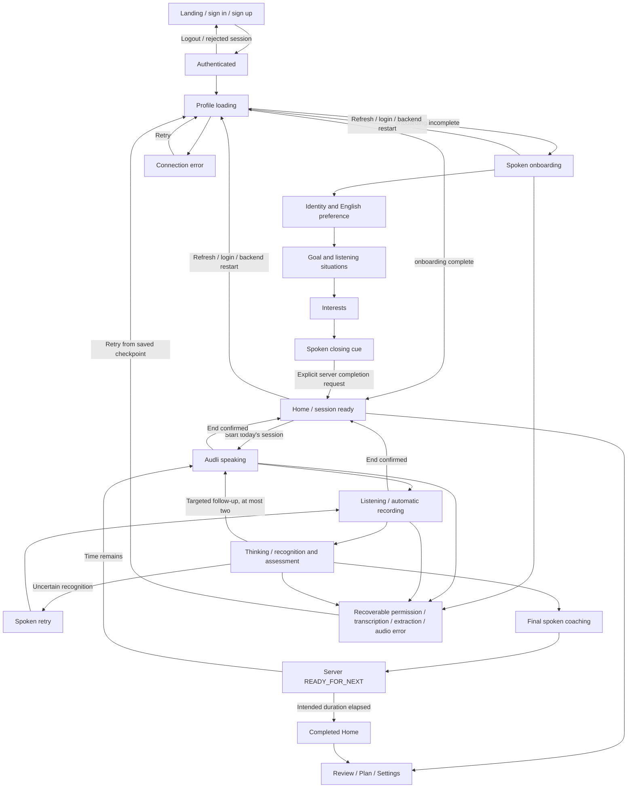

# Authenticated application flow and hands-free coaching (AUD-15 / AUD-17)

AUD-17 implements the owner-approved written product-shell/session specification and the persisted Figma Mascot System (`TOyKOA5mrWAWI8WvvS7lvy`, nodes `7:23`–`7:80`). The other two Figma pages were lost by the connector; their absence is not a design brief. This implementation is local, uncommitted and awaits review. No hosted acceptance is claimed here. AUD-17 remains In Progress.

## Authoritative navigation

`app.onboarding.application_destination(profile)` remains the sole onboarding routing decision. ApplicationFlow loads GET /profile inside AuthGate and selects onboarding or the authenticated product shell. Names, exercise existence, browser timing and token refresh do not decide onboarding completion.

The landing and auth screens contain no learner data. Sign-up preserves confirmed-email behavior. The account/session-keyed private component and token provider are unchanged in responsibility. Settings exposes the existing local sign-out operation; logout immediately invalidates operations and unmounts private content before remote sign-out completes. Cross-tab sign-out/account change also cancels old work. Ordinary token refresh preserves the operation generation.

## Spoken onboarding

The existing persisted state machine is unchanged: `not_started` → `in_progress` (identity, needs, interests) → `profile_saved` (review) → `complete`. Three grouped spoken turns capture preferred name/English, reason/listening situations and interests. Application code still validates structured extraction and chooses stages. English is the only supported language. Speaking fluency never supplies listening evidence.

After Let's talk, `/onboarding/start` resolves before prompt audio is requested. This removes the old revision-0/start race. Every prompt audio request still includes its checkpoint revision. A 409 reloads the authoritative checkpoint using the **same LessonOperation**, then retries audio at most once if the stage is still appropriate. A changed stage, pending answer or completed profile takes its saved path instead. No optimistic concurrency protection is relaxed.

Successful recognition is not shown in a form. The client submits its unedited text with `confirmed: true, hands_free: true`; the server checks the saved recognition, confidence and uncertainty before extraction. Recognition with uncertainty, null/low confidence or blank text receives a spoken retry and automatic listening. After two consecutive automatic recognition retries, recovery pauses with an actionable microphone/retry message. Failed extraction preserves pending recognition; retry/refresh restores that checkpoint without repeating completed stages. Malformed extraction and unsupported language remain recoverable 422 responses.

The review stage now speaks a short closing statement, then makes the explicit, idempotent `/onboarding/complete` request. Completion returns to Home; the first listening session starts with Home's primary action. There is no routine recognition or profile-confirmation form. The existing review-only `/onboarding/revise` endpoint remains compatible, but a completed-profile editing feature is not invented. Legacy `profile_saved` learners without spoken progress still explicitly begin identity. No completed onboarding reset is offered.

## Hands-free session lifecycle

`useVoiceLifecycle` owns the presentation/audio state; the server conversation owns learning progression. Its account-bound LessonOperation spans the continuation through audio, recording, upload, assessment, follow-up and coaching. Pure visual components receive state and never choose evidence, follow-ups, scores or adaptation.

1. Start requests microphone permission, then loads/resumes the current authenticated exercise and conversation.
2. LISTENING plays the private exercise automatically. Only its ended event requests `/conversation/listened`.
3. AWAITING_SUMMARY/AWAITING_FOLLOWUP plays the issued coaching cue, then records automatically.
4. The original MediaRecorder helper collects the final chunk before upload. Web Audio measures microphone RMS locally: at least 300ms of voice, at least two seconds of recording and an 1.8-second silence gap end a normal turn. No speech ends after 15 seconds; continuous sound remains capped at 119 seconds. This is turn detection, not a new ASR/evaluation provider. Tracks, analyser/source, timer and AudioContext are cleaned on completion/cancellation.
5. The original recording Blob is retained only during a failed transcription request. Successful transcription releases it; server pending recognition supports reload/restart. No transcript textarea or routine confirmation appears.
6. Reliable unedited recognition automatically requests assessment. Server ASR guards run before evaluator/checkpoint mutation; evaluator transcription concern still rejects without adaptation. The pending recognized answer remains available for retry. Previously learner-confirmed corrections are restored verbatim through the compatible manual API path. If a transcription response is lost after the server saved it, that pending checkpoint supersedes the retained upload Blob; a follow-up always records fresh audio.
7. The server's follow-up or GIVING_FEEDBACK response determines the next spoken cue. Follow-ups automatically return to listening. Final coaching completes before `/conversation/ready`.
8. At READY_FOR_NEXT, the client either generates another exercise using the authenticated persisted profile or returns to completed Home when the intended duration has elapsed. Adaptation still happens only in the existing final assessment transaction.

The intended duration is ten minutes (`SESSION_DURATION_MS`). The countdown uses actual elapsed wall-clock time and whole minutes. At expiry it says “Finishing this conversation”, never zero, while the current finite server conversation finishes. It cannot interrupt an assessment or claim completion early. Account/session-scoped sessionStorage stores only start time and active/paused/complete presentation status. Refresh restores timing when available and **always** reloads server conversation state. Clearing storage, switching devices or logging out does not lose learning checkpoints; a new Start resumes the server exercise with a new local timing window. This is pacing, not a new server session/eligibility model. AUD-16 daily enforcement is absent; completed Home retains an optional Start another session action.

Replay rewinds only currently playing audio. It does not create another request, restart recording or repeat a domain transition. End opens an accessible confirmation; confirming stops playback/recording, aborts operations, discards unuploaded audio and returns Home. Saved server progress remains. Late microphone acquisition stops its tracks; late successful audio bodies cannot create blob URLs after cancellation. Object URLs are revoked in playback cleanup. Stable object refs mean ordinary rerenders never pause or regenerate speech.

TTS/autoplay/network/microphone failures pause in a recoverable state with Retry conversation and accessible cue text. Retry reloads the server checkpoint, preserving final assessments and pending recognition. Native speech/codec/autoplay restrictions can require a user gesture on this exceptional path. Automatic turn detection requires a browser with MediaRecorder and Web Audio; unsupported browsers receive an actionable error rather than a misleading recording state. No realtime/WebRTC, custom ASR/TTS or new providers are introduced.

## Product shell and mascot

Home has one dominant Start today's session action, the living mascot and a concise listening description. Completed Home uses restrained success motion and Review today. Review shows recent persisted coaching observations and eligible transcripts; it does not show internal scores. Transcript requests remain server-gated. A collapsed secondary transcript appears in the active session only after a server final result; Review accesses completed history. Plan explains saved goals and the application's automatic learning approach without adaptation controls. Settings contains account, voice/playback, accessibility, privacy and help explanations. Floating Home / Review / Plan / Settings navigation is absent in focused sessions.

The mascot uses inline vector geometry from the approved Figma export: teal bridge, white opening, blue and coral ear pads; no eyes/mouth. Listening marks, thought dots, waves, restrained success marks and retry cue follow the supplied storyboard. CSS provides 3.5s breathing at 1–1.025 scale, attentive 2.5° listening, 3px thinking drift/dot rhythm, playback-driven speaking movement, a single 160ms success lift/squash and 3° retry pose. Listening marks react to detected microphone activity. Speaking motion follows actual successful playback lifetime; it does not analyse TTS amplitude. No GIF/video, spinner, confetti or gamification is used.

System prefers-reduced-motion always disables animation; Settings can additionally reduce motion. Static poses, state text, focus rings, keyboard-operable navigation, cue text and a focus-contained/Escape-dismissable exit confirmation preserve comprehension without motion.

## Minimal API additions

All routes retain existing server-verified Supabase identity, request-scoped ownership, origin/body limits and no-store private responses. No endpoint accepts learner identity.

- GET /api/profile additionally returns `recognition_min_confidence`, the existing configured threshold.
- POST /api/onboarding/answer and POST /api/attempts/{id}/assess additionally accept optional `hands_free` (default false for compatible manual clients). Automatic text must match saved recognition and pass the confidence/uncertainty gate. Manual confirmation behavior remains compatible. Automatic assessment rejection uses existing 422/uncertain semantics; no evaluator is called and no learner state is changed.
- POST /api/recognition/retry-audio speaks one fixed recovery phrase through the existing provider/sanitization boundary. It is authenticated, contains no learner content, retains no audio and cannot advance any checkpoint. Client automatic retries are bounded; public provider budgets remain deferred hardening.
- Onboarding's closing prompt copy changes; completion, revision locks, persistence formats and all other contracts remain unchanged.

## Persistence, security and configuration

AUD-15's version-1 onboarding object remains in the existing profile JSON/JSONB snapshot. Atomic account-scoped revision comparisons/projections, SQLite BEGIN IMMEDIATE, PostgreSQL transactions, historical defaults and legacy learner compatibility are unchanged. No Migration 002 or production SQL is needed. Migration 001 SHA-256 remains `f6e51fc8983b97d32f775142b0a996c7ca8a68ca9be9ba81c0df8e544143b1cf`.

The existing **single API worker** requirement remains. No changes to Supabase, Render, Vercel, .env, dependencies, schema, provider configuration or auth/persistence architecture are required. Browser session timing is never authorization. Requests already accepted by FastAPI may finish for their original account after cancellation; they cannot adopt another account's token. Audio remains private bearer-fetch content. PostgreSQL learner isolation/durability, transcript gates, demonstrated/misunderstood/insufficient-evidence semantics, zero-to-two follow-ups, final-feedback limits and deterministic one-variable adaptation are preserved.

## Controlled acceptance after approved release

1. Use separately confirmed test accounts A/B. Verify Landing sends no learner requests and unauthenticated retry/onboarding routes return 401. Confirm sign-in/signup/logout and token refresh still work; no infrastructure changes or SQL are needed.
2. On A, start onboarding and speak the three grouped answers. After the initial gesture and browser microphone permission, finish without tapping. Verify preferred name, English, goal, free-form situations and interests in the authenticated profile; listening priors/counts must not change. Completion must enter Home.
3. Refresh/logout/login after each stage and while a recognized answer is pending. Restart the backend and repeat. Completed stages must not repeat; completed learners skip onboarding. B must retain an independent profile/checkpoint.
4. Start a real ten-minute session. Verify exercise → spoken cue → listening → processing → follow-up(s), if warranted → final coaching happens without clicks. Check silence turn ending in a quiet room and realistic pauses/background noise. Confirm the 119-second limit, whole-minute countdown and completion only after server coaching/READY_FOR_NEXT. Time can overrun while the final exercise completes.
5. Check replay during speech, End/Stay with mouse and keyboard, focus containment and Escape. End during speech/recording/provider work must stop resources and discard browser continuations while preserving server progress.
6. Verify uncertainty/no speech conversationally retries without an ASR form or learning-state change. Deny permission, block transcription/extraction/TTS requests and retry; saved recognition/assessment must remain. Repeated uncertainty must pause rather than loop indefinitely.
7. Delay A's permission, audio body, checkpoint reload, extraction, completion and exercise generation; switch to B, then release. No A UI/audio/result may appear under B, no A continuation may use B's bearer token, and late media/URLs must be cleaned.
8. Before final assessment, transcript requests remain 403. After completion, Review may load the eligible transcript; B's requests for A's exercise/audio/attempt remain 404. Verify at most two insufficient-evidence follow-ups, unknown remains unknown, misunderstood evidence receives correction, final coaching has no questions/metrics and deterministic adaptation changes at most one variable.
9. Inspect mobile/desktop layouts and all six mascot states. Test OS reduced motion and Settings reduction. Verify Home/Review/Plan/Settings navigation and restored authenticated content after refresh.
10. Repeat on real supported Chrome/Safari/mobile devices: browser speech playback, microphone codecs, Web Audio resumption and silence thresholds require actual acceptance. Record hosted outcomes in AUD-17; do not mark it Done from local mock tests alone.

## Verification and deferred work

Automated Auth/AI/media fixtures establish plumbing, isolation and state transitions, not real evaluator accuracy or natural spoken performance. AUD-15's prior verified baseline was backend 284, combined SQLite/PostgreSQL 125, onboarding 30, frontend helpers 38 and Chromium 32. AUD-17 results will be recorded after final checks.

Deferred: public provider budgets/rate limits, TTS coalescing, broader browser/device acceptance, privacy retention/export/deletion, profile-editing product flow, multi-worker redesign and AUD-16 daily eligibility. No placeholder settings, new goals API, dashboard or adaptation algorithm is invented. Figma's missing shell pages are represented by the owner's explicit replacement specification, not an inferred redesign.

### Final local verification — 2026-10-07

| Check | Result |
| --- | --- |
| Complete backend suite | 294 passed |
| SQLite persistence/auth/onboarding/automatic-recognition cases | 83 passed |
| Combined SQLite/PostgreSQL persistence/auth/onboarding/recognition | 137 passed |
| Onboarding/recognition-specific SQLite/PostgreSQL | 42 passed |
| Frontend helper suites | 42 passed |
| Full Chromium suite | 45 passed |
| Lint / standalone typecheck / production build | Passed |
| Python compilation / git diff check | Passed |
| Production dependency audit | 0 vulnerabilities |
| Migration 001 | Byte-identical; no Migration 002 |
| Hosted speech/device/production acceptance | Pending owner review and approved release |

The Chromium suite includes click-free completion, automatic follow-up/retry, real PCM playback across ordinary rerenders, private delayed audio-body cancellation, stale-checkpoint recovery under the original operation, pending-answer resume, preserved prior learner corrections, lost transcription response followed by fresh follow-up capture, End cancellation during capture/assessment, transcript gating, reduced motion, elapsed timing, keyboard exit controls, token refresh and account-switch races through completion/generation. Synthetic provider/media tests do not establish real learner speech quality.

Initial browser assertions needed adjustment for Next.js's separate alert element, Landing after logout and nonserializable function-valued race probes. An initial stale-bundle countdown check and restricted local PostgreSQL/socket runs failed; final complete browser and externally approved local PostgreSQL runs passed. No production system was accessed. The disposable PostgreSQL instance was stopped, generated Next references were restored, and generated/browser artifacts are excluded from the diff. No commit, push or deployment was performed.
